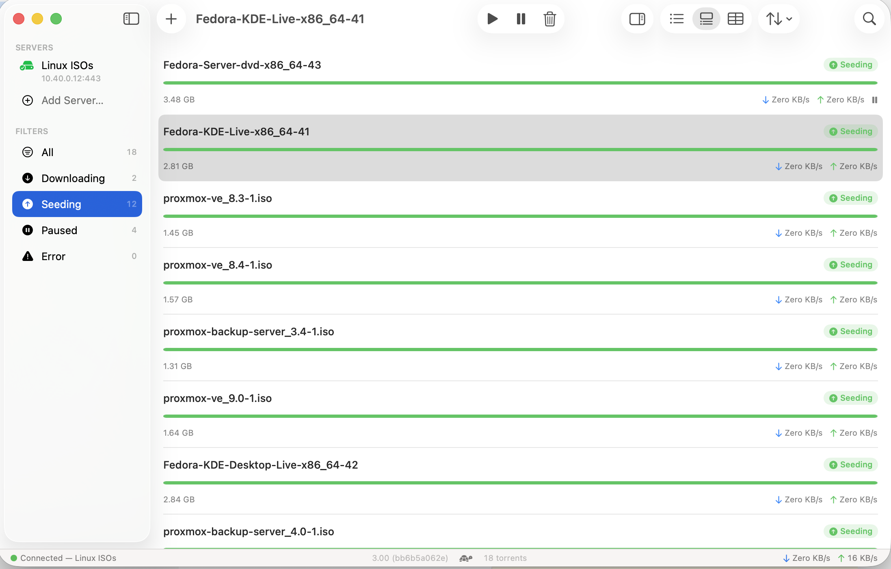

> **Note:** This application was built with the assistance of [Claude](https://claude.ai), Anthropic's AI assistant. All code in this repository was generated or co-authored by Claude.

# Uplink

A native macOS client for the [Transmission](https://transmissionbt.com) BitTorrent daemon. Connects to a remote Transmission instance via its JSON-RPC API.

Built with SwiftUI. No third-party dependencies.

## Features

- **Multi-server support** — manage multiple Transmission daemons and switch between them
- **Three list modes** — compact, detailed, and a sortable column-based table view
- **Full torrent management** — add (URL, magnet, or file), start, pause, remove, verify, reannounce, move, rename
- **File browser** — tree view of torrent contents with per-file priority and include/exclude controls
- **Drag and drop** — drop `.torrent` files or magnet links onto the window
- **Menu bar extra** — quick access to status, speeds, and controls from the macOS menu bar
- **Per-torrent settings** — bandwidth priority, speed limits, seed ratios, peer limits
- **Server settings** — configure daemon settings (speed, queue, network, blocklist) directly from the app
- **Path mappings** — map remote download paths to local folders for Open in Finder support
- **Notifications** — get notified when downloads complete
- **Keyboard-driven** — standard macOS shortcuts throughout
- **Dark and light mode** — uses system colours and materials exclusively

## Requirements

- macOS 15 Sequoia or later
- A running [Transmission](https://transmissionbt.com) daemon with RPC enabled

## Building

1. Clone the repository
2. Open `Uplink.xcodeproj` in Xcode
3. Build and run (Cmd+R)

No packages to resolve. No configuration required.

## License

[GPLv3](LICENSE)
